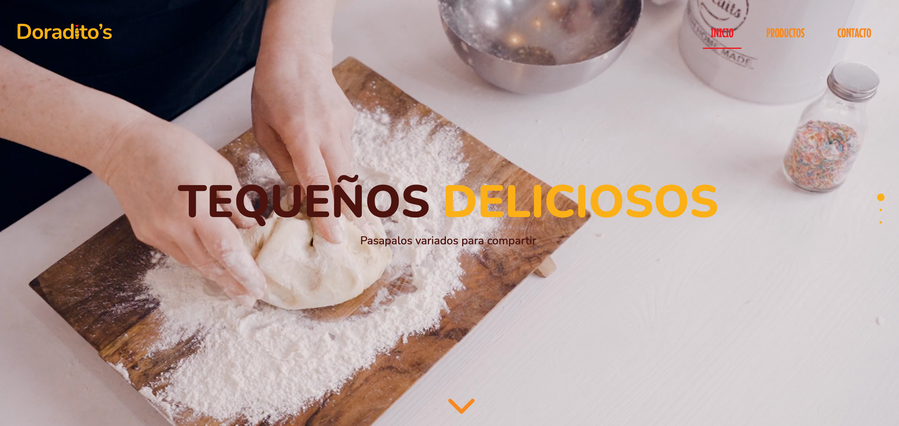
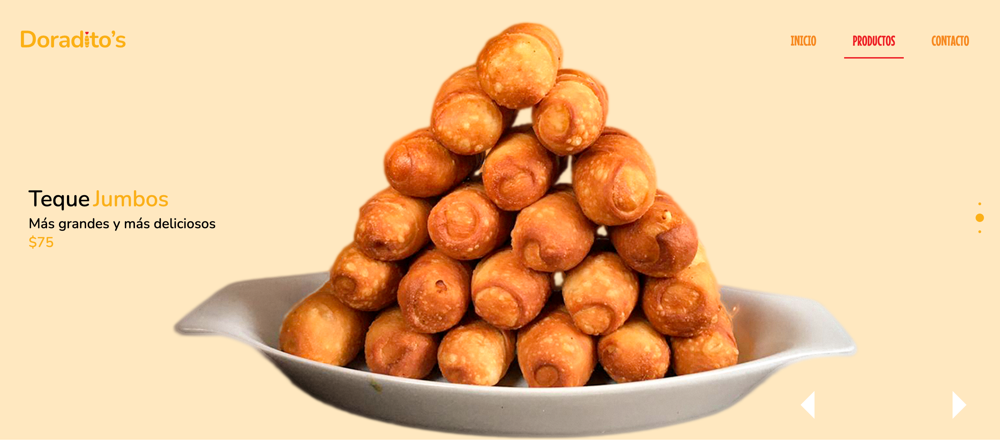
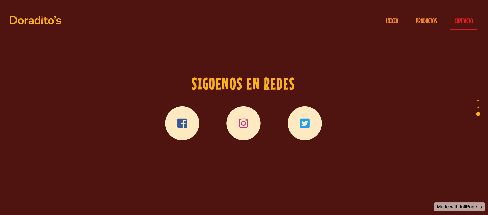

# Landing page: Doradito's

## Table of contents

  - [The challenge](#the-challenge)
  - [Links](#links)
  - [Built with](#built-with)
  - [Useful resources](#useful-resources)

## Overview

### The challenge

This challenge mostly focuses on HTML, CSS and JavaScript using FullPageJs libary.

The users should be able to:

View the optimal layout for the site depending on their device's screen size.

See hover states for all interactive elements on the page. I think as a developer is also important to know how libraries of languages works, read the documentation and understand what is behind to get better results.

By the way I designed the branding of Doraditos, the logo and all mood of this little entreprenuship of venezuelan food.

### Screenshot

### Links
- [Live demo](https://jeraldinnemg.github.io/doraditos/)

## My process

### Built with

- Semantic HTML5 markup.
- CSS custom properties.
- JavaScript.
- FullPageJS library.

### Useful resources

 - [FullPageJS Documentation](https://github.com/alvarotrigo/fullPage.js/tree/master/lang/spanish#fullpagejs) 